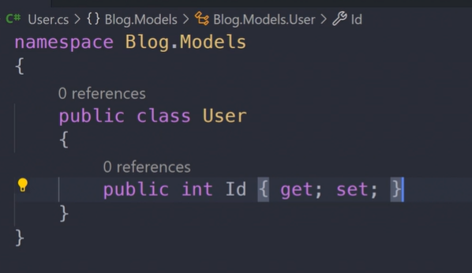

<h1>ENTITY FRAMEWORK</h1>

* Na pasta Models vou criar um arquivo cs para cada tabela com o mesmo nome especificado abaixo 
* Posso ter quantas classes eu quiser 

                        public class User (tabela)
                        {
                            public int Id { get; set; } (coluna)

                            public string Name { get; set; } 

                            public string Email { get; set; } 
                        }

* Comandos

dotnet --version

dotnet new console -o

dotnet add package Microsoft.EntityFrameworkCore

dotnet add package Microsoft.EntityFrameworkCore.SqlServer

                    namespace Projeto1.Data{

                        public class DataContext(representa banco de memória) : DbContext
                        {
                            public DbSet <Categoria> Categorias(representa a tabela de categorias)  { get; set; }

                            public DbSet <User> Users  { get; set; }
                        }
                    }

context.SaveChanges(); -- salva no banco 

context -- para ler qualquer informação no banco

        builder.Property(x => x.Nome)
        .IsRequired() -- nao pode ser nulo
        .HasColumnName("Nome") -- nome da coluna
        .HasColumnType("VARCHAR")
        .HasMaxLength(80); -- o tamanho do campo
        

// criar indices com entity

builder.HasIndex( x=>x.Nome, "IX_Categoria_Nome");
.IsUnique() -- unico

// Relacionamentos

//um para muitos

builder.HasOne(x => x.User)
    .WithMany(x=>.Emails)
    .HasConstraintName("FK_POST_USER); --constraint